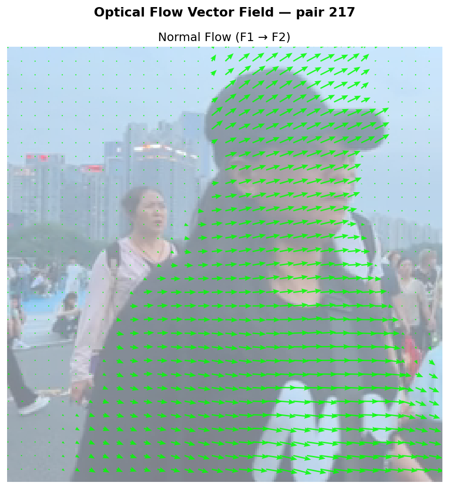
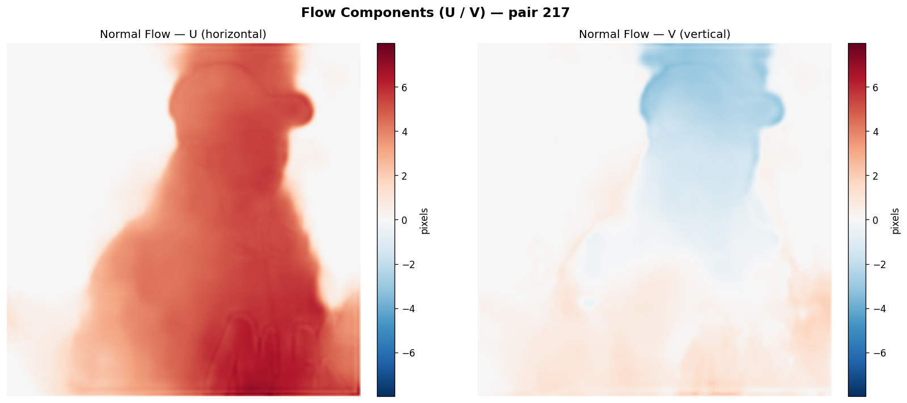

# flowww

Deep learning-based optical flow model for estimating dense motion between video frames, inspired by **RAFT**.

> **Status:** Early development. The architecture, training pipeline, and evaluation setup are still evolving.

## Overview

`flowww` is a lightweight optical flow network designed to estimate dense pixel motion between two consecutive video frames.

The project combines:
- an image encoder for hierarchical feature extraction,
- a correlation / cost-volume module for matching features,
- a ConvGRU-based iterative refinement loop,
- a multi-scale decoder for flow prediction at multiple resolutions,
- training losses including EPE, smoothness, gradient consistency, and photometric warping loss.

The current model has approximately **4.25M parameters**.

For the most detailed architecture walkthrough, refer to `Notebooks/optical_flow.ipynb`.

## Key Features

- Dense optical flow estimation for frame pairs
- RAFT-inspired iterative refinement
- Cost-volume construction over local displacements
- ConvGRU-based recurrent update block
- Multi-scale supervision
- Photometric loss with warping
- Edge-aware smoothness regularization
- Training and validation utilities
- Visualization helpers for flow maps, histograms, and inference outputs

## Architecture

At a high level, the model follows this pipeline:

1. **Encoder** extracts multi-scale features from both input frames.
2. **Cost Volume** computes local feature correlations between the two feature maps.
3. **Cost Volume Encoder** compresses the correlation tensor.
4. **ConvGRU** iteratively refines a coarse flow estimate.
5. **Decoder** upsamples the hidden state and predicts flow at multiple scales.

### Main Components

- **Residual Blocks** for feature refinement
- **Encoder** with early downsampling and skip connections
- **CostVolume** for local matching
- **ConvGRUCell** for iterative updates
- **FlowDecoder** for multi-scale flow outputs
- **AttentionGate** for skip/context fusion
- **Warping utilities** for photometric supervision

## Repository Structure

```text
flowww/
├── configs/              # Configuration files
├── Notebooks/            # Notebook for architecture and experimentation
├── scripts/              # Training entry points
├── src/                  # Dataset, model, loss, and visualization code
├── models/               # Saved model checkpoints
└── requirements.txt
````

## Requirements

Install the Python dependencies:

```bash
pip install -r requirements.txt
```

## Dataset

The current training setup uses a triplet-based dataset format:
- `img1`
- `img2`
- `flow`
Samples are resized to a fixed resolution, and the flow fields are scaled accordingly.

## Training

Training logic is implemented in `scripts/train.py` and prototyped in `Notebooks/optical_flow.ipynb`.

The pipeline includes:

- mixed precision training,
- AdamW optimization,
- OneCycleLR scheduling,
- gradient clipping,
- multi-scale loss,
- photometric loss on finer scales.

## Inference

Average Endpoint Error (EPE): **1.33** on inference samples

### Combined Visualization


This visualization summarizes model predictions, error signals, and flow characteristics in a single view.

---

### Flow Direction (Quiver Plot)

<p align="center">
  
</p>

The quiver plot represents flow vectors (direction + magnitude) at sampled points.

---

### Flow Components (U/V Maps)

<p align="center">
  
</p>

- **U (horizontal displacement)**
- **V (vertical displacement)**

These maps visualize the raw flow components learned by the model.

---

### Interpretation

- Smooth regions → consistent motion  
- Sharp transitions → motion boundaries / object edges  
- Noise/artifacts → areas for further model improvement  

## Notes
- This project is still under active development.
- Architecture and training settings may change as the model is refined.
- The notebook is the best reference for the latest implementation details.

## License
This project is licensed under the MIT License — see the [LICENSE](LICENSE) file for details.
